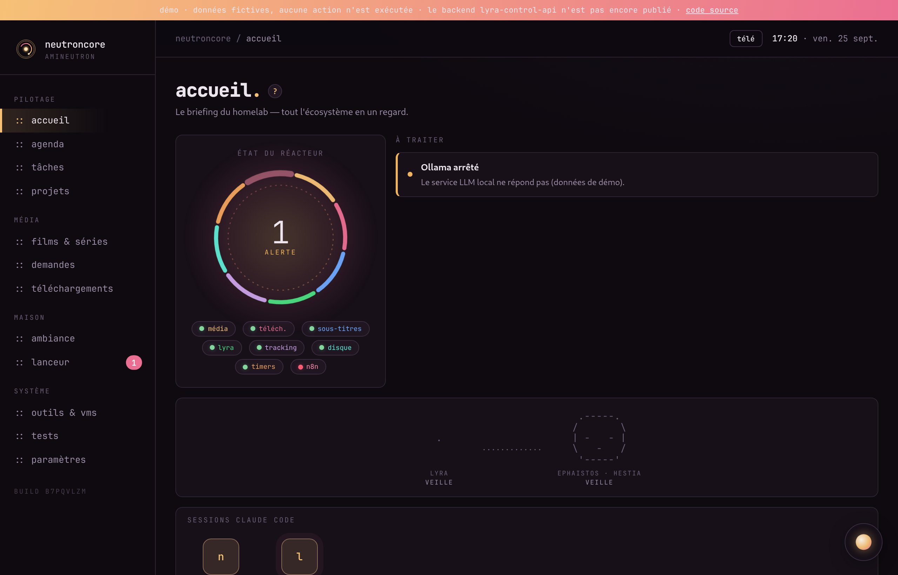
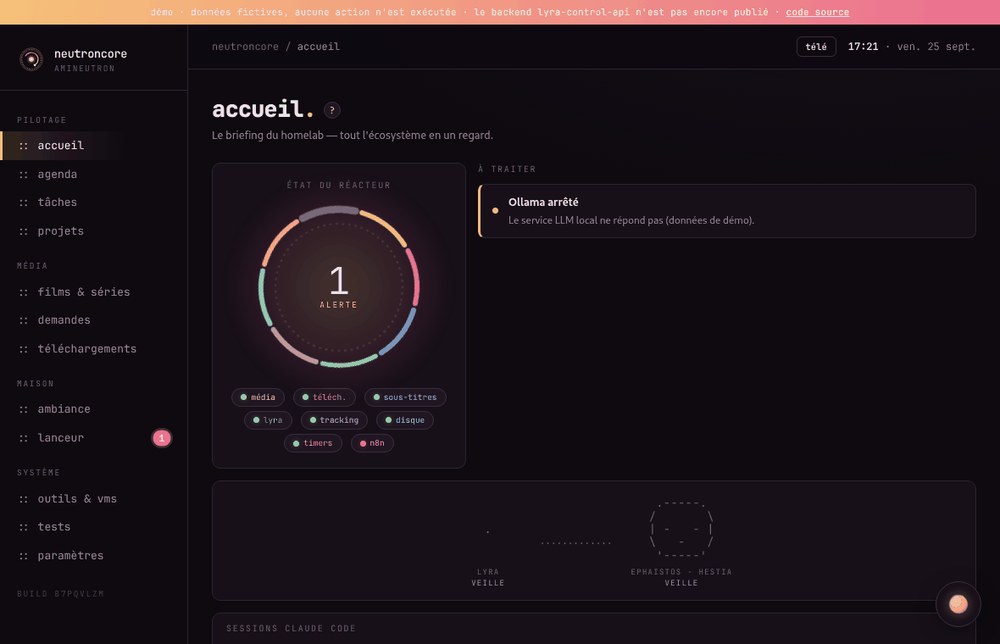
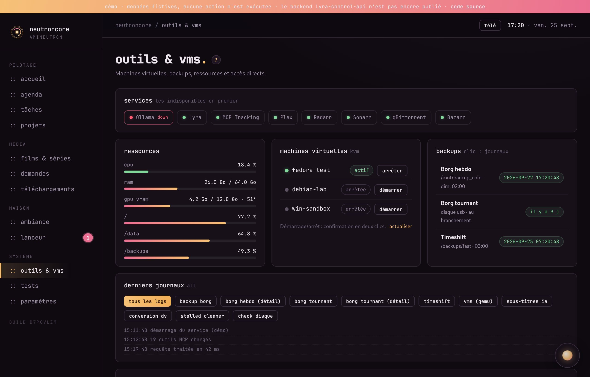
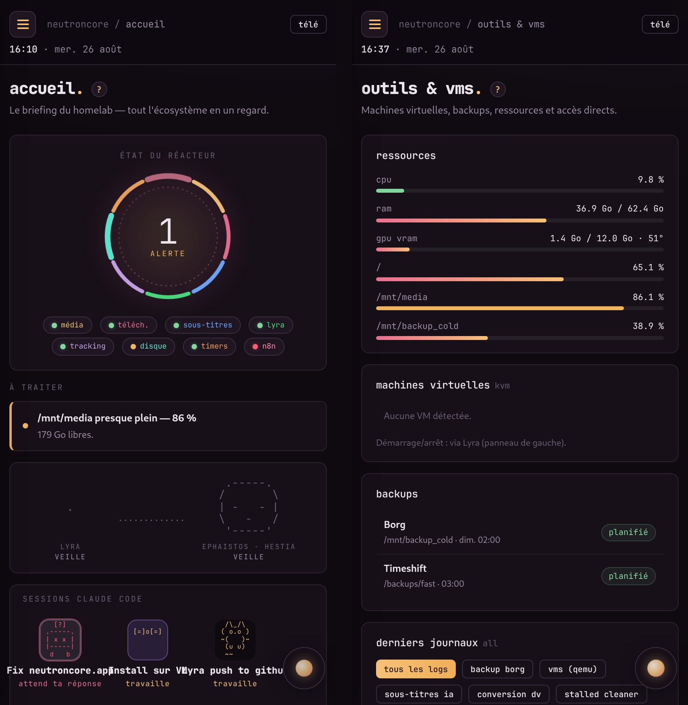
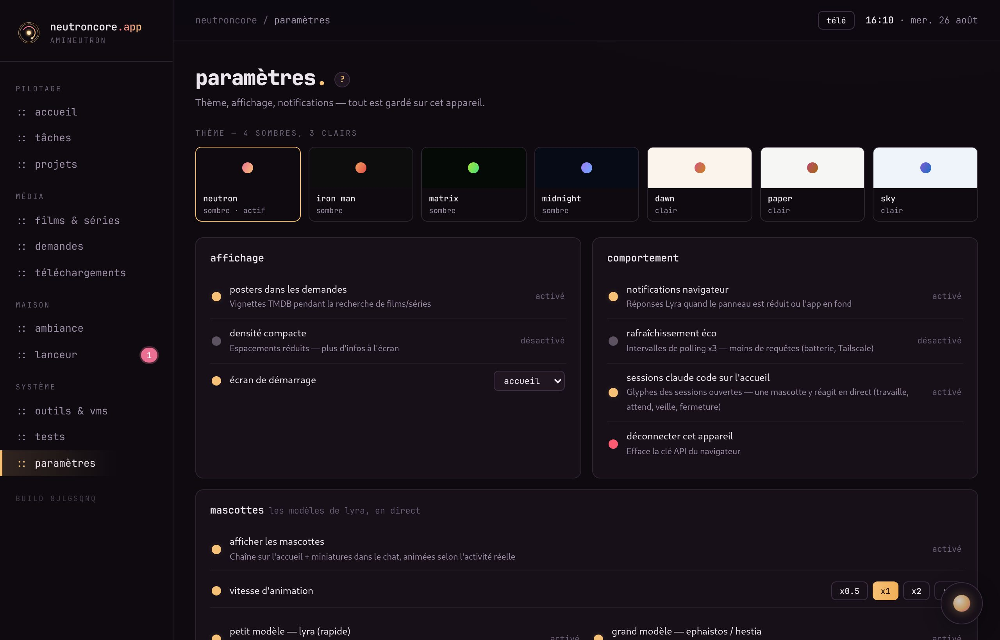

<p align="center">
  
</p>

<h1 align="center">neutroncore</h1>

<p align="center">
  Le hub de mon homelab en une seule interface : etat des services, taches de fond,
  mediatheque, domotique et sessions Claude Code, pilotees par Lyra.<br>
  PWA React + coque Android (Capacitor), servie par <code>lyra-control-api</code> et accessible depuis le telephone via Tailscale.
</p>

<p align="center">
  
</p>

**English summary.** neutroncore is the PWA hub of a self-hosted homelab: services, background tasks, media library, home automation, tracked projects and Claude Code sessions, driven by the Lyra assistant. React 19 + Vite + TypeScript, no UI library, served by the (not yet published) lyra-control-api backend. See [ARCHITECTURE.md](ARCHITECTURE.md).

## Demo



Captures reelles de l'application servie par `lyra-control-api`, prises par [`docs/demo/record.py`](docs/demo/record.py) (Chrome sans fenetre via Playwright, assemblage Pillow). La cle API est lue dans `~/.lyra-control.env` et n'apparait jamais a l'ecran.

## Ce que ca fait

| Ecran | Contenu |
|---|---|
| accueil | "etat du reacteur" (sante globale), alertes a traiter, mascottes des modeles Lyra, sessions Claude Code en cours |
| taches | tracking temps reel (sessions Lyra, conversions DV, scripts), journal, timers systemd |
| projets / lanceur | ouvrir un dossier ou lancer Claude Code sur le PC depuis le telephone, suivre et repondre aux sessions |
| films & series | mediatheque, calendrier des sorties, espace disque, demandes |
| pipeline media | telechargement, sous-titres, conversion : avancement en direct |
| ambiance | lumieres Hue, TV, ampli |
| outils & vms | services, ressources (CPU/RAM/VRAM/disques), VMs KVM (démarrage / arrêt confirmés en deux clics), backups Borg/Timeshift, journaux |
| tests | batterie de tests Lyra |
| parametres | 7 themes, densite, notifications, mascottes, mode tele |

<p align="center">
  
</p>

## Architecture

Vue détaillée dans [ARCHITECTURE.md](ARCHITECTURE.md).

```
telephone (APK Capacitor)  --Tailscale-->  lyra-control-api (:9876)  -->  Lyra, MCP, systemd, stack media...
navigateur (PWA)           --------------->      sert dist/ sur /app/
ntfy (docker, IP Tailscale uniquement)  <--  notifications push (Claude attend / a fini, alertes)
```

- **Frontend** : React 19 + Vite + TypeScript, design system maison dans `src/styles.css`, aucune lib UI.
- **Backend** : `lyra-control-api` (Python), depot separe. Sans lui, l'interface affiche l'ecran de connexion et rien d'autre.
- **Auth** : cle Bearer saisie au premier lancement (localStorage) ; actions destructives protegees par un jeton HMAC 30 s a usage unique (`X-Confirm`).
- **Android** : la coque charge directement l'URL du backend sur le tailnet, donc `npm run build` suffit pour mettre a jour le telephone, sans recompiler l'APK.

<p align="center">
  
</p>

## Lancer

```bash
npm install
cp .env.example .env.local        # hote media, IP Tailscale, tailnet
npm run dev                       # proxy /api -> http://127.0.0.1:9876
npm run build                     # dist/ servi par lyra-control-api sur /app/
./neutroncore-app.sh              # fenetre bureau flottante (chrome --app)
```

### APK Android

```bash
./build-apk.sh            # genere AndroidManifest.xml et network_security_config.xml
./build-apk.sh --install  # depuis les templates .in + .env.local, puis gradle + adb
```

Les fichiers Android qui contiennent des adresses (manifest, config reseau) ne sont pas versionnes :
ils sont regeneres a chaque build depuis les templates `*.in` et ton `.env.local`.

### Notifications push (ntfy)

`ntfy/` contient un `docker-compose.yml.example` et un `server.yml.example` : ntfy auto-heberge,
ecoute uniquement sur l'IP Tailscale du PC, acces refuse par defaut, un utilisateur + jeton.
Voir `ntfy/README.md`.

<p align="center">
  
</p>

## Secrets

Aucun secret dans le depot : cle API cote client en localStorage, jetons ntfy et cles des services
lus par le backend depuis `~/.lyra-control.env` et `systemd-creds`. Les IP/tailnet sont dans `.env.local` (gitignore).

## Licence

MIT

## Part of the Lyra ecosystem

| Dépôt | Rôle |
|---|---|
| [lyra](https://github.com/amineutron/lyra) | assistant DevOps vocal, local par défaut (AGPL-3.0) |
| [fedora-agents](https://github.com/amineutron/fedora-agents) | MCP : machines virtuelles KVM et sauvegardes |
| [mcp-tracking](https://github.com/amineutron/mcp-tracking) | MCP + API + tableau de bord des tâches longues |
| [neutroncore](https://github.com/amineutron/neutroncore) | hub PWA du homelab |
| [hue-mcp](https://github.com/amineutron/hue-mcp) | MCP Philips Hue (fork de ThomasRohde/hue-mcp) |
| [pylips-mcp](https://github.com/amineutron/pylips-mcp) | MCP TV Philips |
| [denon-mcp](https://github.com/amineutron/denon-mcp) | MCP ampli Denon |
| [catt-mcp](https://github.com/amineutron/catt-mcp) | MCP Chromecast et DLNA |
